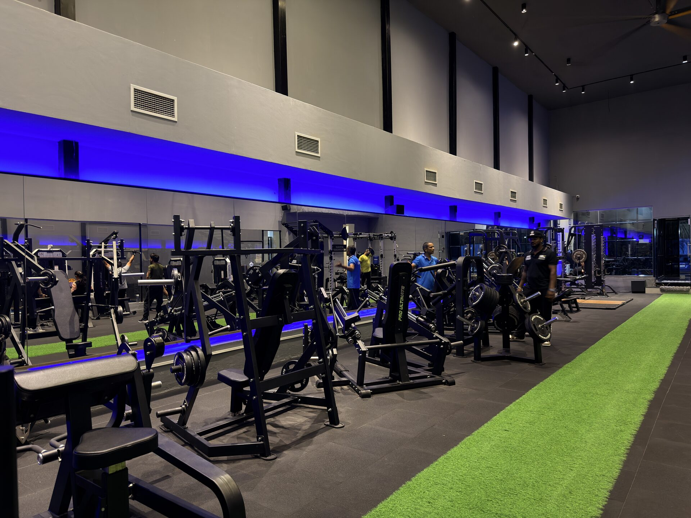

# Images — Sorted by Screen Size

Same 28 photos, resized and organized by device breakpoint instead of by format. Each folder has both JPEG and WebP for every photo.

| Folder | Max width | Use for |
|---|---|---|
| `mobile/` | 640px | Phones |
| `tablet/` | 1200px | Tablets, small laptops |
| `desktop/` | 1920px | Laptops, desktops, large screens |
| `logo/` | 256 / 512 / 1024px | Site logo |

## Naming

Files are renamed sequentially and tagged by device, e.g.:

```
photo-01-mobile.jpg
photo-01-mobile.webp
photo-01-tablet.jpg
photo-01-tablet.webp
photo-01-desktop.jpg
photo-01-desktop.webp
```

`photo-01` is the same photo across all three folders — just resized — so you can match them up by number.

## How to use (responsive `<picture>`)

```html
<picture>
  <source media="(max-width: 640px)"  srcset="mobile/photo-01-mobile.webp"   type="image/webp">
  <source media="(max-width: 1200px)" srcset="tablet/photo-01-tablet.webp"   type="image/webp">
  <source                              srcset="desktop/photo-01-desktop.webp" type="image/webp">

  <source media="(max-width: 640px)"  srcset="mobile/photo-01-mobile.jpg">
  <source media="(max-width: 1200px)" srcset="tablet/photo-01-tablet.jpg">
  
</picture>
```

The browser loads only the file that matches the visitor's screen — mobile visitors never download the 1920px desktop version.
